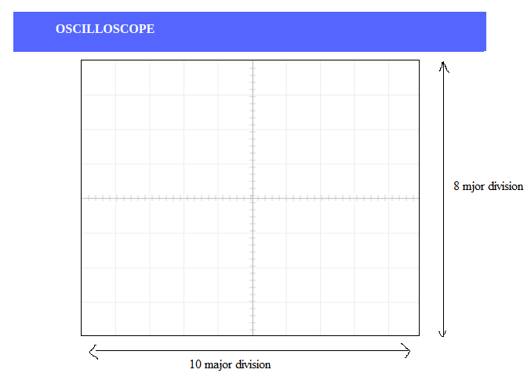

# Theory

Operational Amplifier commonly known as Op-Amp, is a linear elcectronic device having three terminals, two high impedence input and one output terminal. Op-Amp can perform multiple function when attached to diffrent feedback combinations like resistive, capacitive or both. Generally it is used as voltage amplifier and the output voltage of the Op-Amp is the diffrence between the voltages at its two input terminals.

Op-Amp shows some properties that make it an ideal amplifier, its open loop gain and input impedance is infinite (i.e.,practically very high), Output impedance and offset voltage is zero(i.e.,practically very low) and bandwidth is infinite(i.e.,practically limitted to frequency where its gain become unity).

Figure 1  

### The Integrator

It is a circuit designed with Op-Amp in such a way that it performs the mathametical Integration operation, its output is proportional to the amplitude and time duration of the input applied. The integrator circuit layout is same as a inverting amplifier but the feedback resistor is replaced by a capacitor which make the circuit frequency dependent. In this case the circuit is derived by the time duration of input applied which results in the charging and discharging of the capacitor. Initially when the voltage is applied to integrator the uncharged capacitor allows maximum current to pass through it and no current flows through the Op-Amp due to the presence of virtual ground, the capacitor starts to charge at the rate of RC time constant and its impedence starts to increase with time and a potential diffrence is develops accross the capacitor resulting in charging current to decrease.This results in the ratio of capacitor's impedance and input resistance increasing causing a linearly increasing ramp output voltage that continues to increase until the capacitor becomes fully charged.

Figure 2  

Since, the Output voltage is the potential difference accross capacitor.
$$V_C = \frac{Q}{C}$$				           
or,   $$V_C = V_X - V_{OUT} = -V_{OUT}$$                                     
$$therefore -\frac{dVout}{dt} =\frac{1}{C} \times \frac{dQ}{dt}$$                    	
$$\frac{dQ}{dt}$$ is the current as the $$V_x$$ is 0.
and input current can be written as 
         $$I_{IN} = \frac{(V_{IN} -0)}{R_{IN}}  $$                                                                                  
and current through capacitor  If can be  written as 
         $$I_f = C \times \frac{dVout}{dt} = C \times \frac{1}{C} \times \frac{dQ}{dt} = \frac{dQ}{dt}$$   
Assuming the ideal Op-amp its input impedance is infinite so no current pass through it.
         $$I_{IN} = I_f =\frac{V_{IN} }{R_{IN}} = C \times \frac{dVout}{dt}$$                            
therefor,  $$\frac{V_{IN}}{V_{OUT}} \times \frac{dt}{R_{IN} \times C} = 1$$                                  
so, $$V_{OUT} = -\frac{1}{R_{IN} \times C}  &int; Vin. dt$$                                   
or, 
$$V_{OUT}  =-\frac{1}{j \times &omega; R_{IN} \times C} \times V_{IN}$$                                                                    
where (-) sing indicates 108 degree phase shift.

### The Differentiator

In the differentiator circuit the input is connected to the the inverting output of the Op-Amp through a capacitor(C) and a negetive feedback is provided to the inverting input terminal through a resistor(Rf), which is same as an integrator circuit with feedback capacitor and input resistor being replaced with each other. Here the circuit performs a mathematical differentiation operation, and the output is the first derivative of the input signal, 180' out of phase and apmlified with a factor Rf*C. The capacitor on the input allows only the AC component and restrict the DC, at low frequency the reactance of capicitor is very high causing a low gain and high frequency vice varsa but and high frequency the circuit becomes unstable.

Figure 3  

Since, the node voltage \(V_x\) is 0  
        $$I_{IN}= I_f = - \frac{V_{OUT}}{R_f}$$                                                          
The charge accross capacitor is given by,
       $$Q = C \times V_{IN}$$				                                 
 The rate of change of charge is:
       $$\frac{dQ}{dt} = C \times \frac{dV_{IN}}{dt}$$                                             
and we know that $$\frac{dQ}{dt}$$  is capacitor current,
  $$I_f = C \times \frac{dV_{IN}}{dt} = I_{IN}$$		                                  
Therefore from eq. 4.1 and 4.4, 
     $$-\frac{V_{OUT}}{R_f} = C \times \frac{dV_{IN}}{dt}$$                                         
and Output voltage is
     $$V_{OUT} = -R_f \times C \times \frac{dV_{IN}}{dt}$$ 

## Oscilloscope Tutorial

An oscilloscope displays a voltage waveform versus time and has the following components:
- a screen to display a waveform,
- input jacks for connecting the signal to be displayed,
- dials to control how the signal will be displayed.

The screen is cathode ray tube found in most television sets where the face of the screen is divided up into a 2 dimensional grid (or axes or scale); In this experiment we consider 8x10 grid. The vertical grid is divided up into 8 (major) divisions and the horizontal grid is divided into 10 major divisions. To improve the precision, each of these divisions is further broken up into 5 minor divisions. The horizontal axis (X-axis) represents time and the vertical axis (Y-axis) represents voltage. The scope displays (also called a signal trace or trace) the input signal voltage along the vertical (or Y-axis) while an internally generated signal (called the horizontal sweep or sweep signal) is simultaneously produced along the X-axis creating a 2- dimensional time trace of the input signal

Figure 4  

**volts/div**- This control lets you change how many volts are represented by each vertical increment of grid (vertical axis) on the screen. Basically, it allows you to zoom in and out along the y axis.

**time/div**- This control lets you change how much time is represented by each horizontal increment of the grid overlay on the screen. It allows you to zoom in and out along the x axis.

If volt/div is set to 1 volt which implies each mazor vertical division is 1 volt where as each minor vertical division is 0.2 volt. And time/div is set to 0.1ms/div which implies each maor horiontal division is 0.1ms. Voltage on the vertical scale is 1 volt/div multiply by (number of division). Time on the horizontalscale is 0.1msec multiply by (number of division). In the figure 5, 1 volt/div and amplitude of the input signal is 1 volt. Here 0.1mses/div, the frequency is 1 kHz and its period is 1 complete cycle in 1m sec.

Figure 5  

In the figure 6, if volt/div is set to 2volt/div, which implies each mazor division is 2 volt where as each minor division is 0.5volt.

Figure 6  

**Note:** If you set the Volts/Div too low, you’ll clip the signal. Similarly, setting it too high, and you’ll won’t find the signal, i.e. the signal will b flat. ncreasing the Timebase will display more cycles of a periodic signal. Conversely, reducing the Timebase, fewer cycles will be displayed.

Virtual Oscilloscope Tutorial : [Virtual Oscilloscope Tutorial](http://vlabs.iitkgp.ac.in/be/exp18/content/Oscilloscope%20Details_intg_diff_opamp.pdf)

