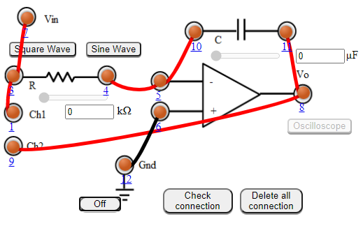
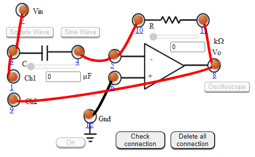

### Procedure

#### Experiment
- Integrator using OpAmp
1. Connect the components as mentioned below:
L1-L7 or L1-L3, L3-L7, L4-L5, L11-L8, L12-L6, L8-L9, L4-L10.(For eg. click on 1 and then drag to 3 and so on.)
2. Click on 'Check Connection' button to check the connections.
3. If connected wrong click on 'Delete all connection' button to erase all the connections.
4. Set the resistance(R) and the capacitance (C) (Intially set R=10 kΩ and C=0.1 µF).
5. Click on 'ON' button to start th experiment.
6. Click on 'Square Wave' button to generate input waveform.
7. Click on 'Oscilloscope' button to get the output waveform.
8. Vary the Amplitude, Frequency, volt/div using the controllers.
9. Click on "Dual" button to observe both the waveform.
10. Channel 1 shows the input square waveform, Channel 2 shows the output waveform.
11. Repeat the experiment by applying 'Sine wave' as input.
12. Click on 'Sine Wave' button to generate input waveform.
13. Click on 'Oscilloscope' button to get the output waveform.
14. Vary the Amplitude, Frequency, volt/div using the controllers.
15. Click on "Dual" button to observe both the waveform.
16. Channel 1 shows the input sine waveform, Channel 2 shows the output waveform.
17. Note : Sometimes due to page load or cache, the graph may not come exact at one click. So it is better to double click on the channel-1 function/ channel-2 function/ dual function/ ground function to get the respective signals.

                                    

Figure:1

- Differentiator using opamp
1. Connect the components as mentioned below:
L1-L7 or L1-L3, L3-L7, L4-L5, L11-L8, L12-L6, L8-L9, L4-L10.(For eg. click on 1 and then drag to 3 and so on.)
2. Click on 'Check Connection' button to check the connections.
3. If connected wrong click on 'Delete all connection' button to erase all the connections.
4. Set the resistance(R) and the capacitance (C) (Intially set R=1 kΩ and C=0.1 µF).
5. Click on 'ON' button to start th experiment.
6. Click on 'Square Wave' button to generate input waveform.
7. Click on 'Oscilloscope' button to get the output waveform.
8. Vary the Amplitude, Frequency, volt/div using the controllers.
9. Click on "Dual" button to observe both the waveform.
10. Channel 1 shows the input square waveform, Channel 2 shows the output waveform.
11. Repeat the experiment by applying 'Sine wave' as input.
12. Click on 'Sine Wave' button to generate input waveform.
13. Click on 'Oscilloscope' button to get the output waveform.
14. Vary the Amplitude, Frequency, volt/div using the controllers.
15. Click on "Dual" button to observe both the waveform.
16. Channel 1 shows the input sine waveform, Channel 2 shows the output waveform.
17. Note : Sometimes due to page load or cache, the graph may not come exact at one click. So it is better to double click on the channel-1 function/ channel-2 function/ dual function/ ground function to get the respective signals.

Figure: 2

