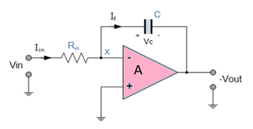

## Theory

Operational Amplifier commonly known as Op-Amp, is a linear elcectronic device having three terminals, two high impedence input and one output terminal. Op-Amp can perform multiple function when attached to diffrent feedback combinations like resistive, capacitive or both. Generally it is used as voltage amplifier and the output voltage of the Op-Amp is the diffrence between the voltages at its two input terminals.

Op-Amp shows some properties that make it an ideal amplifier, its open loop gain and input impedance is infinite (i.e.,practically very high), Output impedance and offset voltage is zero(i.e.,practically very low) and bandwidth is infinite(i.e.,practically limitted to frequency where its gain become unity).

Figure 1  

### The Integrator

It is a circuit designed with Op-Amp in such a way that it performs the mathametical Integration operation, its output is proportional to the amplitude and time duration of the input applied. The integrator circuit layout is same as a inverting amplifier but the feedback resistor is replaced by a capacitor which make the circuit frequency dependent. In this case the circuit is derived by the time duration of input applied which results in the charging and discharging of the capacitor. Initially when the voltage is applied to integrator the uncharged capacitor allows maximum current to pass through it and no current flows through the Op-Amp due to the presence of virtual ground, the capacitor starts to charge at the rate of RC time constant and its impedence starts to increase with time and a potential diffrence is develops accross the capacitor resulting in charging current to decrease.This results in the ratio of capacitor's impedance and input resistance increasing causing a linearly increasing ramp output voltage that continues to increase until the capacitor becomes fully charged.

Figure 2  

Since, the Output voltage is the potential difference accross capacitor.
$$V_C = \frac{Q}{C}$$				           
or,   $$V_C = V_X - V_{OUT} = -V_{OUT}$$                                     
therefore $$-\frac{dVout}{dt} =\frac{1}{C} \times \frac{dQ}{dt}$$                    	
$$\frac{dQ}{dt}$$ is the current as the Vx is 0.
and input current can be written as 
         $$I_{IN} = \frac{(V_{IN} -0)}{R_{IN}}  $$                                                                                  
and current through capacitor  If can be  written as 
         $$I_f = C \times \frac{dVout}{dt} = C \times \frac{1}{C} \times \frac{dQ}{dt} = \frac{dQ}{dt}$$   
Assuming the ideal Op-amp its input impedance is infinite so no current pass through it.
         $$I_{IN} = I_f =\frac{V_{IN} }{R_{IN}} = C \times \frac{dVout}{dt}$$                            
therefor,  $$\frac{V_{IN}}{V_{OUT}} \times \frac{dt}{R_{IN} \times C} = 1$$                                  
so, $$V_{OUT} = -\frac{1}{R_{IN} \times C}  &int; Vin. dt$$                                   
or, 
$$V_{OUT}  =-\frac{1}{j \times &omega; R_{IN} \times C} \times V_{IN}$$                                                                    
where (-) sing indicates 108 degree phase shift.

### The Differentiator

In the differentiator circuit the input is connected to the the inverting output of the Op-Amp through a capacitor(C) and a negetive feedback is provided to the inverting input terminal through a resistor(Rf), which is same as an integrator circuit with feedback capacitor and input resistor being replaced with each other. Here the circuit performs a mathematical differentiation operation, and the output is the first derivative of the input signal, 180' out of phase and apmlified with a factor Rf*C. The capacitor on the input allows only the AC component and restrict the DC, at low frequency the reactance of capicitor is very high causing a low gain and high frequency vice varsa but and high frequency the circuit becomes unstable.

Figure 3  

Since, the node voltage Vx is 0  
        $$I_{IN}= I_f = - \frac{V_{OUT}}{R_f}$$                                                          
The charge accross capacitor is given by,
       $$Q = C \times V_{IN}$$				                                 
 The rate of change of charge is:
       $$\frac{dQ}{dt} = C \times \frac{dV_{IN}}{dt}$$                                             
and we know that $$\frac{dQ}{dt}$$  is capacitor current,
  $$I_f = C \times \frac{dV_{IN}}{dt} = I_{IN}$$		                                  
Therefore from eq. 4.1 and 4.4, 
     $$-\frac{V_{OUT}}{R_f} = C \times \frac{dV_{IN}}{dt}$$                                         
and Output voltage is
     $$V_{OUT} = -R_f \times C \times \frac{dV_{IN}}{dt}$$ 

